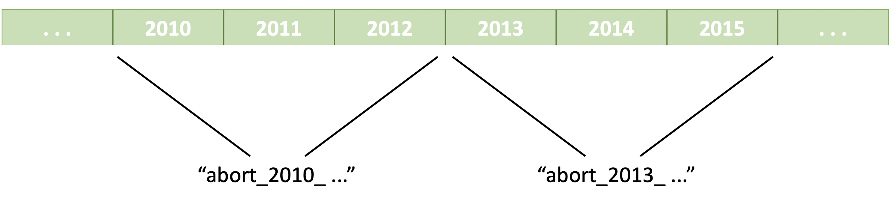

# Hansard Word Embeddings

A project for the UTSC LiPaD, to train word embeddings on the Hansard database, to examine how discussion has changed about certain topics over time.

**scripts** contains all relevant scripts used to run the training and corpus collection. 

### Process Notes

1. Merging of old party names into new party names is opinionated, check hansard_corpus.ipynb for details
2. Current investigation is for words related to abortion, and the investigation process is to tag keywords related to abortion with the party and year to track the progress through word embedding space through time. Choice of keywords to change is described with regex right now. 
3. The base corpus is extracted with replacement for every year. Groupings of years, such as (2000, 2001, 2002) -> 2000, (2003, 2004, 2005) -> 2003 to reduce noise and increase relevancy of abortion can be run after the base corpus is run. Currently up to 6 years of grouping has been done.

4. Additionally, there is an option to create a rolling grouping, so (2000,2001,2002) -> 2001, (2001, 2002, 2003) -> 2002 and so on. This requires the corpus to be increased by the factor of grouping, since the corpus needs to be repeated for these rolling groupings to be defined. Only rolling groupings for 3 years has been done. 

5. Training parameters can be found in hansard_training.ipynb. Models trained are gensim.Word2Vec models, and the most important parameter, min_count (minimum count of word for the word to be considered) is decided empiricaly through ensuring the replaced word appears in years as often as possible. More in sandbox.ipynb. 
6. It is generally seen that the more often two words appear, the less variable their distance to each other is. 

### Issues 

1. More rigorous selection of min_count and the effects of this hyperparameter
2. More rigorous analysis of variability of word embeddings, rough sketch done in hansard_application.ipynb
3. More rigorous cutoff of years, as years before 1968 have very small counts, resulting in a bias in the model embeddings. This can be examined in hansard_application.ipynb
4. More models need to be trained to examine the noise, right now 7 models only. Preferably close to 40? 
5. Notebooks are lazy, hopefully the workflow can be streamined through scripts, config YAMLs and maybe CLI interfaces.  

Notes: the corpora and the models trained are too large, they can be provided upon request.
